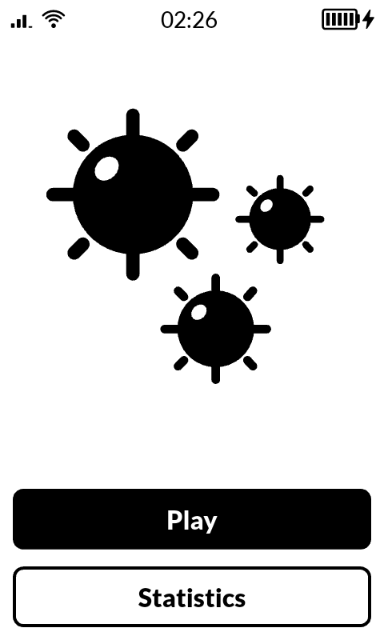
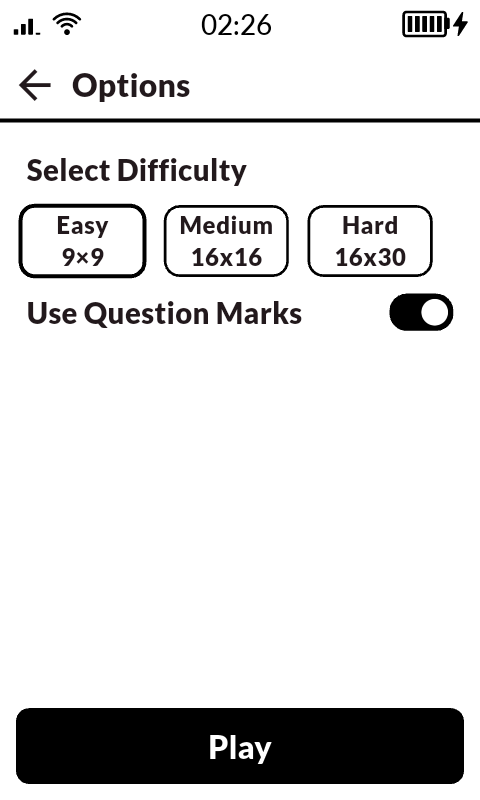
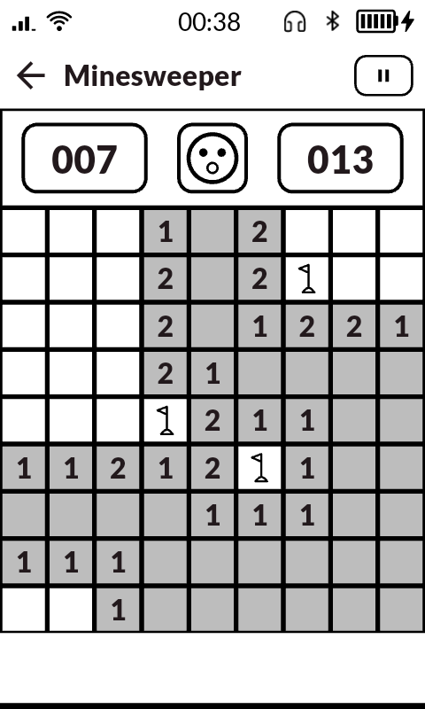
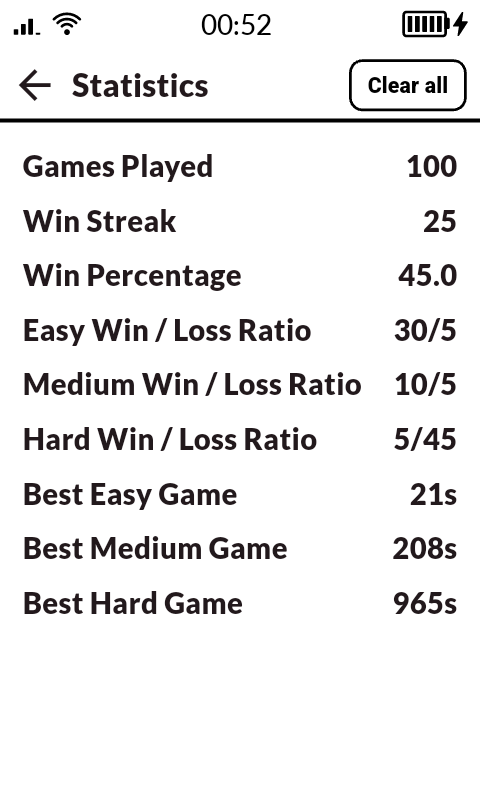

# Minesweeper

### Donate

Please consider making a small donation for an indie dev!!

## Background

Having begun to use the [Mudita Kompakt](https://mudita.com/) as my daily driver cellphone, I discovered a small open source community building and sharing apps that target the Kompakt with it's e-ink screen and minimalist design. 

This small implementation of minesweeper was a personal project to learn flutter and hone my skills in mobile app design and development. While this app could have easily been vibe-coded in a single prompt, I would not have learned anything about Flutter's architecture, nor would I have gained any experience designing and building mobile apps. Perhaps most importantly, I would not have any of the satisfaction of an engineer seeing a project from start to finish, building something from the ground up. 

## Installation

You may either install from the Releases section of this project (I recommend using [Obtainium](https://wiki.obtainium.imranr.dev/)) or you may build from source. 
### Screenshots

<table>
  <tr>
    <td align="center">
       
    </td>
    <td align="center">
       
    </td>
    <td align="center">
       
    </td>
    <td align="center">
       
    </td>
  </tr>
</table>

## Design 

Mudita Kompakt users should find the UI very familiar. I quickly embraced the aesthetic and felt compelled to build something in the same style. Special thanks to @Splaypanther44 for help with SVG design.

## Contributing

PR and forks would be cool however unlikely. I've kept it simple but there are a lot of features I could see for this and perhaps web support.

